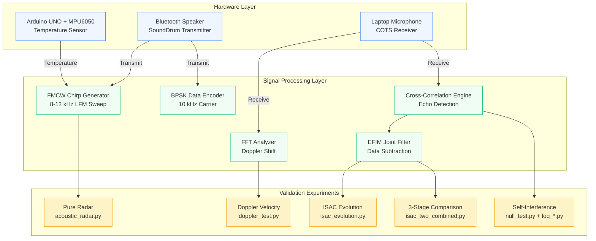
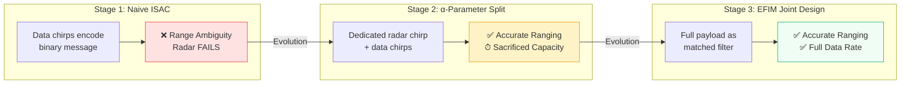

<div align="center">

# 6G ISAC Physical Validation

**Real-World Validation of 6G Integrated Sensing and Communication Fundamental Limits Using COTS Acoustic Hardware**

[](LICENSE)
[](https://www.python.org/)
[](https://www.ieee.org/)
[]()
[]()

---

*The first fully physical acoustic analog of a 6G ISAC system built entirely from low-cost Commercial Off-The-Shelf (COTS) hardware — validating the Capacity-Distortion trade-off, Inverse Square Law degradation, EFIM joint design, and self-interference cancellation in real-world environments.*

[Overview](#-overview) · [Key Results](#-key-results) · [Architecture](#-system-architecture) · [Getting Started](#-getting-started) · [Scripts](#-scripts-overview) · [Results](#-experimental-results) · [Citation](#-citation)

</div>

---

## 🔬 Overview

**Integrated Sensing and Communication (ISAC)** is a foundational pillar of future 6G networks, enabling devices to use the same wireless waveform for both data transmission and radar sensing. However, balancing these two conflicting objectives — communication signals must be unpredictable while radar signals must be predictable — creates a strict physical constraint known as the **Capacity-Distortion trade-off**.

While existing literature extensively studies ISAC through theoretical analysis and software simulations, **physical hardware validation remains critically absent**. This project bridges that gap by constructing a **physical acoustic testbed** that uses sound waves — which share key mathematical properties with radio frequency (RF) waves — to transparently and observably validate 6G ISAC signal processing limits in the real world.

### Why Acoustic?

Sound waves and RF waves share fundamental mathematical properties (propagation, reflection, Doppler shift, multipath fading), making acoustics an ideal low-cost, observable analog for 6G ISAC research. Unlike RF testbeds that require expensive spectrum analyzers and signal generators, our acoustic approach enables:

- **Full transparency**: Every signal can be heard, recorded, and analyzed
- **Low cost**: Only a laptop, Bluetooth speaker, and Arduino are needed
- **Rapid iteration**: No spectrum licensing, no RF shielding requirements
- **Direct validation**: Physical phenomena (multipath, Doppler, Inverse Square Law) manifest identically

---

## 🏆 Key Results

| Metric | Result | Significance |
|--------|--------|-------------|
| **Radar Accuracy (Ideal)** | **0.3 cm mean error** at 1.0 m | Sub-centimeter ranging validates FMCW chirp correlation |
| **Doppler Velocity** | **2.02 m/s** (walking) / **2.98 m/s** (running) | Accurate velocity tracking via FFT frequency shift |
| **DSP Boundary** | **8.74 m** strict processing limit | Array boundary artifact from pulse duration window |
| **Naive ISAC Failure** | **12.48 m error** at 1.0 m target | Demonstrates catastrophic range ambiguity without proper design |
| **EFIM Joint Design** | **Accurate ranging + data recovery** | Validates that EFIM filter achieves simultaneous sensing and communication |
| **Self-Interference Cancellation** | **Significant noise reduction** via phase nulling | Stereo phase destructive interference suppresses leakage |

---

## 🏗 System Architecture



### ISAC Three-Stage Evolution

The core experiment validates three evolutionary stages of ISAC waveform design:



| Stage | Approach | Radar | Communication | Trade-off |
|-------|----------|-------|---------------|-----------|
| **1 — Naive** | Up/down chirps encode data bits | ❌ Catastrophic range ambiguity | ✅ Data decodable | Unusable for sensing |
| **2 — α-Parameter** | Separate radar chirp (2–6 kHz) + data chirps (8–12 kHz) | ✅ Dedicated band works | ⚠️ Reduced capacity (extra chirp overhead) | Time-division sacrifice |
| **3 — EFIM Joint** | Full payload as matched filter; data subtraction for radar isolation | ✅ Accurate ranging | ✅ Full-speed data | Best balance (theoretical optimum) |

---

## 🚀 Getting Started

### Prerequisites

| Component | Requirement | Purpose |
|-----------|-------------|---------|
| **Python** | 3.8 or higher | Runtime environment |
| **Laptop** | Built-in microphone | Acoustic receiver |
| **Speaker** | Bluetooth/external (e.g., SoundDrum) | Acoustic transmitter |
| **Arduino UNO** | With MPU6050 sensor | Temperature calibration (optional) |
| **USB Cable** | For Arduino serial connection | COM17 at 9600 baud |

### Installation

```bash
# Clone the repository
git clone https://github.com/Tirth9978/6G-ISAC-Physical-Validation.git
cd 6G-ISAC-Physical-Validation

# Install Python dependencies
pip install numpy scipy sounddevice matplotlib pyserial
```

### Hardware Setup

1. **Connect the Bluetooth speaker** and note its device ID
2. **Identify audio device IDs** on your system:
   ```python
   import sounddevice as sd
   print(sd.query_devices())
   ```
3. **(Optional) Connect Arduino** with MPU6050 on COM17 for automatic temperature calibration
4. **Position the speaker** facing a flat wall or target at your desired test distance

### Quick Start — Pure Radar Test

```bash
python acoustic_radar.py
# Enter your device IDs when prompted
# Set target distance (e.g., 1.0 meters)
# Set number of trials (e.g., 10)
```

---

## 📂 Scripts Overview

### Sensing Scripts

#### `acoustic_radar.py` — Pure Acoustic Radar

Standalone FMCW radar that measures distance using chirp cross-correlation. The baseline "pure sensing" experiment with no communication component.

- **Signal**: Linear chirp sweep 8–12 kHz, 0.1 s pulse duration
- **Method**: Cross-correlation of received echo with transmitted template
- **Calibration**: Arduino MPU6050 temperature → speed of sound: `v = 331.3 + 0.606 × T`
- **Output**: `Radar_Stats_{dist}m.txt` + `Radar_Graph_{dist}m.png`

```python
# Key parameters
fs = 44100          # Sample rate (Hz)
f0 = 8000           # Base frequency (Hz)
f1 = 12000          # Peak frequency (Hz)
pulse_duration = 0.1 # Pulse duration (s)
```

#### `doppler_test.py` — Doppler Velocity Measurement

Measures target velocity by tracking Doppler frequency shift on a continuous 10 kHz tone using FFT analysis.

- **Signal**: Continuous 10 kHz sine wave, 2.5 s duration
- **Method**: FFT peak detection in 9900–10100 Hz band → frequency shift → velocity
- **Validated**: Walking speed ~2.02 m/s, running speed ~2.98 m/s
- **Output**: `Doppler_Stats.txt` + `Doppler_Graph.png`

### ISAC Scripts

#### `isac_evolution.py` — ISAC with EFIM Joint Design

The core ISAC validation script. Transmits a combined radar + communication signal and extracts both distance and data simultaneously using the EFIM-inspired data subtraction technique.

- **Radar component**: FMCW chirp (8–12 kHz)
- **Communication component**: BPSK encoding of `"Hi"` at 10 kHz carrier, 50% amplitude
- **Key innovation**: Subtracts reconstructed data signal from received signal to isolate radar echo
- **Output**: `ISAC_Stats_{dist}m_{T}s.txt` + `ISAC_Graph_{dist}m_{T}s.png`

#### `isac_two_combined.py` — 3-Stage Evolutionary Comparison

The most comprehensive experiment. Runs all three ISAC design stages in a single trial and produces a 3-subplot comparison showing the progression from naive failure to EFIM success.

- **Stage 1**: Naive ISAC — up/down chirps encode data (fails for radar)
- **Stage 2**: α-Parameter — separate radar chirp (2–6 kHz) + data chirps (8–12 kHz)
- **Stage 3**: EFIM Joint — full payload as matched filter with data subtraction
- **Output**: Per-trial logs + plots saved to `ISAC_{dist}m_{T}s/` subdirectories

### Self-Interference Cancellation Scripts

#### `null_test.py` — Phase Null Calibration

Performs a 10-second phase sweep (0°→360°) on a stereo 10 kHz signal to map the destructive interference null pattern of the laptop's acoustic channel.

- **Output**: Phase angle vs. mic volume curve with annotated null point
- **Purpose**: Discovers the optimal phase for self-interference cancellation

#### `loq_auto_stealth.py` — Auto-Calibrating Stealth System

Two-phase operation: (1) automatic phase sweep to discover the physical null point of the laptop chassis, then (2) demonstrates BPSK data transmission with and without null steering.

- **Phase 1**: 8-second stereo sweep → minimum RMS → null angle
- **Phase 2**: Normal vs. stealth BPSK transmission comparison

#### `loq_stealth_data.py` — Stealth with Known Null

Simplified version using a pre-discovered null angle (`MAGIC_PHASE = 7.2°`) for quick self-interference cancellation demonstrations.

- **Use case**: After running `null_test.py`, plug the discovered angle into this script

---

## 📊 Experimental Results

### Radar Calibration — Sub-Centimeter Accuracy

Pure radar ranging at 1.0 m with Arduino-calibrated speed of sound (350.47 m/s):

| Trial | Measured Distance |
|-------|-------------------|
| 1 | 0.989 m |
| 2 | 1.017 m |
| 3 | 1.017 m |
| 4 | 0.989 m |
| 5 | 0.989 m |
| 6 | 1.017 m |
| 7 | 1.009 m |
| 8 | 1.009 m |
| 9 | 0.989 m |
| 10 | 0.997 m |
| **Mean** | **1.003 m** |
| **Std Dev** | **0.012 m** |
| **Mean Error** | **0.3 cm** |

### Doppler Velocity Tracking

| Test | Frequency Shift | Measured Velocity |
|------|----------------|-------------------|
| Walking | +57.60 Hz | 2.02 m/s |
| Running | +85.20 Hz | 2.98 m/s |

### ISAC System Parameters

| Parameter | Value |
|-----------|-------|
| Sample Rate (f<sub>s</sub>) | 44,100 Hz |
| Pulse Duration (T) | 0.05 s / 0.1 s |
| Base Frequency (f<sub>0</sub>) | 8,000 Hz |
| Peak Frequency (f<sub>1</sub>) | 12,000 Hz |
| Speed of Sound (calibrated) | 349.9 m/s |

### Indoor vs. Outdoor Validation

| Environment | Result | Cause |
|-------------|--------|-------|
| **Indoor (cluttered room)** | EFIM filter failed — spike at 8.75 m instead of 2 m target | Multipath echoes amplified by EFIM math drowned out intended target |
| **Outdoor (open air, short range)** | EFIM filter worked precisely as theoretically expected | Minimal multipath; clean propagation |
| **Outdoor (6 m, 0.05 s pulse)** | Acoustic echo fell below noise floor; false edge artifact at 8.74 m | Inverse Square Law energy dissipation + DSP array boundary |

### The 8.74 m DSP Boundary

At 6 meters with a 0.05 s pulse, the round-trip distance is ~12 meters. The target echo falls completely below the environmental noise floor. The EFIM filter's 0.05 s window equals exactly 8.74 meters of travel — when it finds only static, the algorithm generates a false peak at the array boundary. This perfectly demonstrates the **strict range-energy constraint** of ISAC waveforms.

---

## 📁 Repository Structure

```
6G-ISAC-Physical-Validation/
├── acoustic_radar.py              # Pure FMCW acoustic radar
├── doppler_test.py                # Doppler velocity measurement
├── isac_evolution.py              # ISAC with EFIM joint design
├── isac_two_combined.py           # 3-stage ISAC comparison
├── null_test.py                   # Phase null calibration sweep
├── loq_auto_stealth.py            # Auto-calibrating stealth system
├── loq_stealth_data.py            # Stealth with known null angle
├── ISAC_Graph_1.0m_0.1s.png      # ISAC result plot (1.0 m, 0.1 s pulse)
├── ISAC_Graph_1.0m_0.5s.png      # ISAC result plot (1.0 m, 0.5 s pulse)
├── ISAC_Stats_1.0m_0.1s.txt      # ISAC statistics (1.0 m, 0.1 s pulse)
├── ISAC_Stats_1.0m_0.5s.txt      # ISAC statistics (1.0 m, 0.5 s pulse)
├── Radar_Graph_1.0m.png          # Pure radar result plot (1.0 m)
├── Radar_Stats_1.0m.txt           # Pure radar statistics (1.0 m)
├── ISAC_1.0m_0.1s/               # Detailed 10-trial data (1.0 m, 0.1 s)
│   ├── ISAC_Logs_1.0m_0.1s/      # Per-trial text logs
│   │   ├── ISAC_Log_1.0m_0.1s_Trial1.txt
│   │   └── ... (10 trials)
│   └── ISAC_Plots_1.0m_0.1s/     # Per-trial correlation plots
│       ├── ISAC_Plot_1.0m_0.1s_Trial1.png
│       └── ... (10 trials)
└── ISAC_5.0m_0.1s/               # Detailed 10-trial data (5.0 m, 0.1 s)
    ├── ISAC_Logs_5.0m_0.1s/
    └── ISAC_Plots_5.0m_0.1s/
```

---

## 🔧 Technical Details

### Speed of Sound Calibration

Rather than relying on the standard 343 m/s assumption, the system uses an Arduino UNO with an MPU6050 sensor to actively measure ambient temperature and compute the exact acoustic propagation speed using the thermodynamic formula:

> **v = 331.3 + 0.606 × T<sub>amb</sub>**

where `T_amb` is the ambient temperature in degrees Celsius. For our outdoor test runs, this yielded an exact speed of 349.9 m/s — a 2% improvement over the standard assumption that directly impacts ranging accuracy.

### Signal Design

**FMCW Chirp (Radar):**
- Linear frequency modulated sweep from 8 kHz to 12 kHz
- Configurable pulse duration (0.05 s or 0.1 s)
- 10 ms fade-in/fade-out to prevent speaker pop artifacts

**BPSK Data Encoding (Communication):**
- Message `"Hi"` encoded as 16-bit binary string
- Each bit modulated as `±sin(2π × 10000 × t)` at 10 kHz carrier
- 50% amplitude relative to radar chirp to preserve sensing priority

### EFIM Joint Design Implementation

The Equivalent Fisher Information Matrix (EFIM) filter works by:

1. Cross-correlating the received signal with the **full known data sequence**
2. Mathematically suppressing communication noise from the combined signal
3. Subtracting the reconstructed data component to isolate the radar echo
4. Enabling simultaneous maximum data throughput and precise radar sensing

---

## 👥 Authors

**CT216 Group 14** — Dhirubhai Ambani University (DAU), Gandhinagar, Gujarat, India

| Author | |
|--------|---|
| Tirth Patel | |
| S Srujan | |
| Prakriti Pandey | |
| Prince Patel | |
| Vrunda Patel | |
| Vishwa Prajapati | |
| Jiya Patel | |
| Krishna Solanki | |
| Bhavi Rana | |
| Prayag Kachhia | |
| Aarushi Shah | |

**Contact**: tirthppatel9978@gmail.com

---

## 📖 Citation

If you use this work in your research, please cite:

```bibtex
@article{patel2026isac,
  title={Physical Validation of 6G ISAC Fundamental Limits Using COTS Acoustic Hardware},
  author={Patel, Prince and Srujan, S and Pandey, Prakriti and Patel, Tirth and Patel, Vrunda and Prajapati, Vishwa and Patel, Jiya and Solanki, Krishna and Rana, Bhavi and Kachhia, Prayag and Shah, Aarushi},
  institution={Dhirubhai Ambani University},
  year={2026},
  note={CT216 Group 14 Project Report}
}
```

---

## 📚 References

1. A. Liu et al., "A survey on fundamental limits of integrated sensing and communication," *IEEE Communications Surveys & Tutorials*, vol. 24, no. 2, pp. 994–1034, 2022.
2. F. Liu et al., "Integrated sensing and communications: Toward dual-functional wireless networks for 6G and beyond," *IEEE J. Sel. Areas Commun.*, 2020.
3. A. Hassanien et al., "Dual-function radar communication systems: A solution to the spectrum congestion problem," *IEEE Signal Process. Mag.*, 2019.
4. H. Wang, Z. Xiao, and Y. Zeng, "Cramér-Rao bounds for near-field sensing with extremely large-scale MIMO," *arXiv preprint arXiv:2303.05736*, 2023.
5. M. Kobayashi et al., "Joint state sensing and communication over memoryless multiple access channels," in *Proc. IEEE ISIT*, 2019.
6. A. Guerra et al., "Position and orientation error bound for wideband massive antenna arrays," in *Proc. IEEE ICCW*, 2015.

---

## 🤝 Contributing

Contributions are welcome! Whether you want to add new signal processing techniques, improve the hardware calibration, or extend the testbed to new environments:

1. Fork the repository
2. Create your feature branch (`git checkout -b feature/amazing-feature`)
3. Commit your changes (`git commit -m 'Add amazing feature'`)
4. Push to the branch (`git push origin feature/amazing-feature`)
5. Open a Pull Request

### Ideas for Contributions

- **Extended frequency bands**: Implement ultrasonic transducers for >20 kHz operation
- **Machine learning filtering**: Replace hard-coded EFIM with learned interference cancellation
- **Multi-target tracking**: Extend the radar to detect and distinguish multiple targets
- **RF analog**: Port the acoustic testbed to software-defined radio (SDR) for RF validation
- **Real-time visualization**: Add a live dashboard for in-progress experiment monitoring

---

## 📜 License

This project is licensed under the MIT License — see the [LICENSE](LICENSE) file for details.

---

<div align="center">

**Dhirubhai Ambani University** · Gandhinagar, Gujarat, India

*Validating 6G ISAC theory — one chirp at a time.*

</div>
